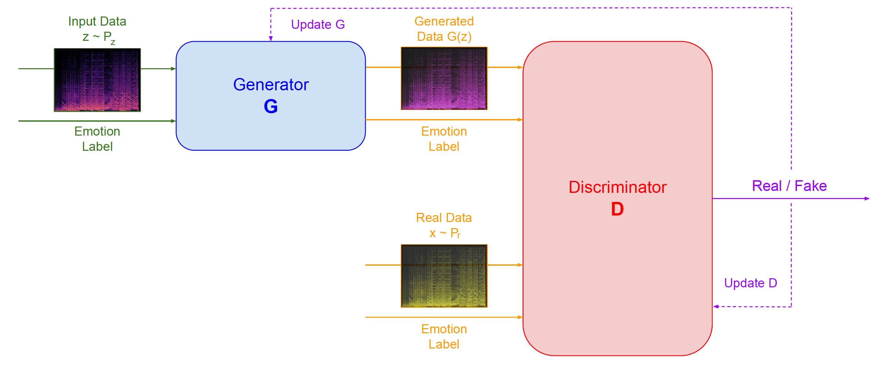
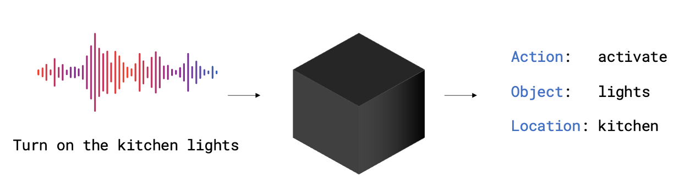
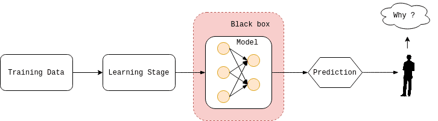
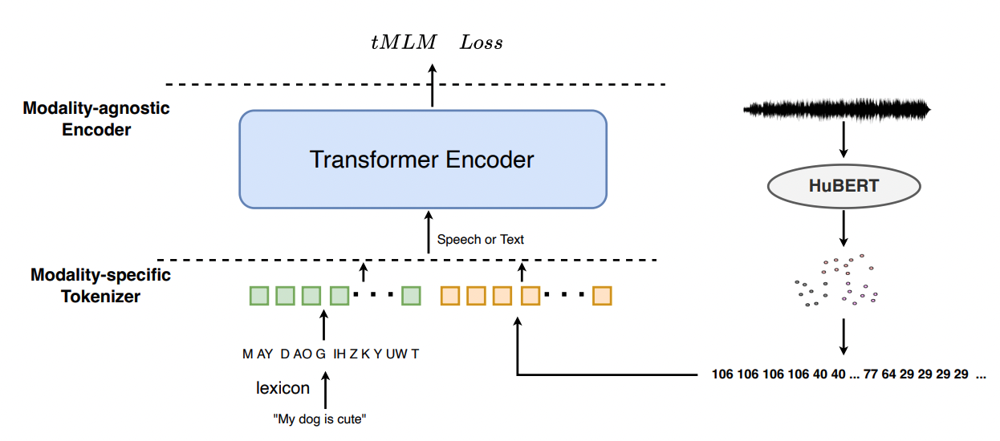

Master Thesis Proposals
=================
Contact Point:

- Alkis Koudounas: alkis.koudounas@polito.it

Table of contents
=================

* [Instructions and templates](#instructions-and-templates-polito-students-only)
* Audio and Speech Processing
    * [Emotional Speech Synthesis](#emotional-speech-synthesis-)
    * [Investigating fairness and bias in E2E SLU Models](#investigating-fairness-and-bias-in-e2e-slu-models-)
    * [Speech XAI, explaining reasons behind speech model predictions](#speech-xai-explaining-reasons-behind-speech-model-predictions-)
    * [Combining Speech and Text Language Models](#combining-speech-and-text-language-models-)

Instructions and templates (PoliTO students only)
============

If you are a student from Politecnico di Torino the latex template to write the master thesis is avaiable in [Overleaf](https://it.overleaf.com/latex/templates/master-thesis-template-polito/jvfrbmxqkscw).

The first step is to create a GitHub Educational account and create an ad-hoc repository containing all relevant code and information for the master thesis.

The research work expected during the development of the master thesis will cover the following steps.

### State-of-the-art exploration
Collect, read and analyze the most recent and relevant publications in the proposed application field. Related works could be summarized and presented by using the Markdown Template available [here](/RW_template.md). Publication could be searched by using the following services:
- [Google Scholar](https://scholar.google.com/)
- [Arxiv](https://arxiv.org/search/)

### Data collection and finding
The majority of the thesis requires a step of data collection or data search. 
During the exploration of the state of the art the student is asked to collect and organize the data used by each publication.
Dataset must be presented in an organized way.
If a new data collection is created/parsed please explain both the data collection procedure and the statistics of the data collection.

### Code development
The code must be organized in a GitHub repository and must be presented in an organized way.
The code must be documented and easy to use.
It also must be tested and be able to run on a different machine.

Audio and Spech Processing
============

### Emotional Speech Synthesis 

Emotional speech synthesis represents a groundbreaking technology that has the potential to reshape human-machine interaction across various domains. 
By infusing synthesized speech with different emotions, this technology can enhance the naturalness and effectiveness of machine-generated speech, opening up new frontiers in virtual agents, human-computer interfaces, entertainment, therapy, and assistive technologies. 
The implications are vast, promising a future where machines can authentically and empathetically communicate emotions, transforming how we interact and engage with artificial systems.

The **main objectives** of this thesis are:
- Analyze the state-of-the-art techniques for emotional speech synthesis.
- Leverage modern deep learning architectures to design a novel approach for this task.
- Demonstrate the effectiveness of the proposed approach using benchmark data collections (e.g., [IEMOCAP](https://sail.usc.edu/iemocap/)).

**References:**

1. [Emotional Speech Synthesis: A Review](http://www1.cs.columbia.edu/~julia/papers/schroeder01.pdf)
2. [Speech Synthesis with Mixed Emotions](https://arxiv.org/pdf/2208.05890.pdf)
3. [Hume AI](https://hume.ai/products/vocal-expression-model/?gad=1&gclid=Cj0KCQjwjryjBhD0ARIsAMLvnF-zqTYXxigxGSXAHtBm8q8J6IZHl7GHarHhUTa_wrKslZCFxNS9cKAaAmuTEALw_wcB7)

***

### Investigating fairness and bias in E2E SLU Models 

Spoken language understanding (SLU) systems typically rely on automatic spee h recognition (ASR) and natural language understanding (NLU) models to derive meaning from speech signals and text. However, end-to-end (E2E) models offer a direct approach to extracting semantic information from speech signals, leading to improved accuracy and reduced complexity. 
Nonetheless, E2E models are complex black-box processes, making it difficult to explain their predictions and interpret their results. Therefore, investigating problematic data subgroups is crucial for understanding and debugging AI pipelines to ensure model fairness.

This project is in collaboration with Amazon Alexa AI.

The **main objectives** of this thesis are:
- Analyze the state-of-the-art E2E SLU models.
- Identify models' bias and source of errors in different scenarios (incremental and curriculum learning).
- Demonstrate the effectiveness of the proposed approach across different models, datasets, tasks.
- (Optional) Propose a novel approach to mitigate the bias and improve the model's performance.

**References:**

1. [Exploring Subgroup Performance in End-to-End Speech Models](https://ieeexplore.ieee.org/abstract/document/10095284/)
2. [Toward Fairness in Speech Recognition](https://assets.amazon.science/e4/33/8a2b9e044cc69f7074de4e6c2c7c/toward-fairness-in-speech-recognition-discovery-and-mititation-of-performance-disparities.pdf)
3. [Shedding light on fairness in AI with a new data set](https://ai.facebook.com/blog/shedding-light-on-fairness-in-ai-with-a-new-data-set/)

***

### Speech XAI, explaining reasons behind speech model predictions 

from *[The AI SUmmer](https://theaisummer.com/xai/)* 

Speech XAI focuses on providing insights into the reasons behind predictions made by speech models. This emerging field aims to enhance transparency and interpretability in speech recognition and synthesis systems. By employing various techniques such as attention mechanisms, saliency maps, and feature importance analysis, Speech XAI enables users to understand why a particular prediction was made. This empowers users to gain insights into the underlying decision-making processes of speech models, fostering trust, accountability, and enabling targeted improvements to ensure more accurate and reliable speech-based applications.

The **main objectives** of this thesis are:
- Analyze the state-of-the-art XAI techniques.
- Design a novel pipeline to analyze and debug speech models and their predictions.
- Demonstrate the effectiveness of the proposed approach using renowned benchmarks (e.g., [SUPERB](https://superbbenchmark.org/)).

**References:**

1. [Towards Relatable Explainable AI with the Perceptual Process](https://dl.acm.org/doi/fullHtml/10.1145/3491102.3501826)
2. [Exploring Subgroup Performance in End-to-End Speech Models](https://ieeexplore.ieee.org/abstract/document/10095284/)
3. [Towards Measuring Fairness in Speech Recognition](https://arxiv.org/abs/2111.09983)

***

### Combining Speech and Text Language Models 

Speech, with its various elements like intonation and non-verbal vocalizations, is considered the earliest form of human language. However, existing systems for understanding spoken language mostly focus on the textual aspect, disregarding these additional components. Recent advancements in speech language modeling and speech synthesis have enabled the development of speech-based language models called SpeechLMs. Nevertheless, despite the increasing prevalence of speech and audio content, text remains the primary mode of communication on the internet. This hampers the construction of large-scale SpeechLMs, unlike the significant achievements seen in textual Language Models (LMs).

The **main objectives** of this thesis are:
- Analyze the state-of-the-art speech models.
- Propose a novel approach to combine speech and text modalities. Specifically, design a novel architecture capable of leveraging the advantages of both modalities.
- Demonstrate the effectiveness of the proposed approach across different datasets and tasks.

**References:**

1. [Textually Pretrained Speech Language Models](https://arxiv.org/abs/2305.13009)
2. [token2vec](https://arxiv.org/abs/2210.16755)
3. [W2v-BERT](https://arxiv.org/abs/2108.06209)