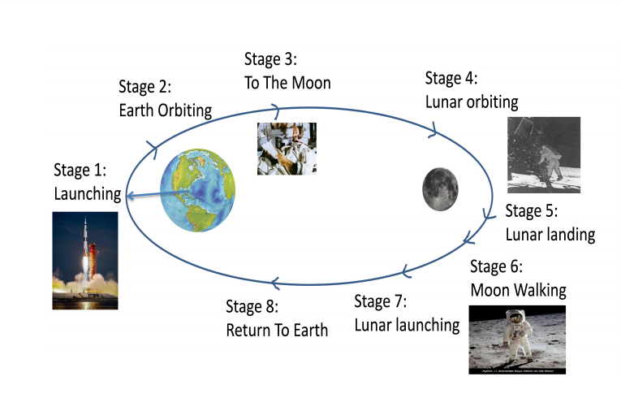
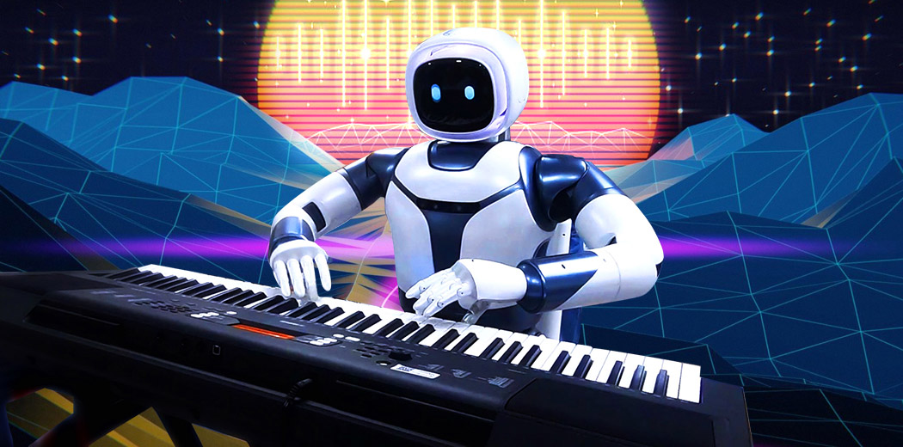

Master Thesis Proposals
=================
Contact Point:

- Alkis Koudounas: alkis.koudounas@polito.it

Table of contents
=================

* [Instructions and templates](#instructions-and-templates-polito-students-only)
    * [State-of-the-art exploration](#state-of-the-art-exploration)
    * [Data collection and finding](#data-collection-and-finding)
    * [Code development](#code-development)

* [Thesis Projects on Audio and Speech Processing](#thesis-projects-on-audio-and-speech-processing)
    * [Continual Learning in Spoken Language Understanding scenarios](#continual-learning-in-spoken-language-understanding-scenarios-)
    * [Fearless Step APOLLO](#fearless-step-apollo-)
    * [Emotional Speech Synthesis](#emotional-speech-synthesis-)
    * [Investigating fairness and bias in E2E SLU Models](#investigating-fairness-and-bias-in-e2e-slu-models-)
    * [Speech XAI, explaining reasons behind speech model predictions](#speech-xai-explaining-reasons-behind-speech-model-predictions-)
    * [Combining Speech and Text Language Models](#combining-speech-and-text-language-models-)

* [Graduated Students](#graduated-students)

Instructions and templates (PoliTO students only)
============

If you are a student from Politecnico di Torino the latex template to write the master thesis is avaiable in [Overleaf](https://it.overleaf.com/latex/templates/master-thesis-template-polito/jvfrbmxqkscw).

The first step is to create a GitHub Educational account and create an ad-hoc repository containing all relevant code and information for the master thesis.

The research work expected during the development of the master thesis will cover the following steps.

### State-of-the-art exploration
Collect, read and analyze the most recent and relevant publications in the proposed application field. Related works could be summarized and presented by using the Markdown Template available [here](/RW_template.md). Publication could be searched by using the following services:
- [Google Scholar](https://scholar.google.com/)
- [Arxiv](https://arxiv.org/search/)

### Data collection and finding
The majority of the thesis requires a step of data collection or data search. 
During the exploration of the state of the art the student is asked to collect and organize the data used by each publication.
Dataset must be presented in an organized way.
If a new data collection is created/parsed please explain both the data collection procedure and the statistics of the data collection.

### Code development
The code must be organized in a GitHub repository and must be presented in an organized way.
The code must be documented and easy to use.
It also must be tested and be able to run on a different machine.

Thesis Projects on Audio and Speech Processing
============

### Continual Learning in Spoken Language Understanding scenarios 

Continual learning (CL) is a way for models to keep learning from new data over time. As the data changes or new data comes in, the model needs to adjust and adapt without forgetting what it already learned

**Scenario**: Spoken Language Understanding (virtual assistants, home devices, etc.)

**Problem**: Little to no literature for speech-related tasks.

**Common Approaches**: regularization losses, rehearsal or experience replay, architectural changes.

The **main objectives** of this thesis are:
- Analyze the state-of-the-art techniques for Continual Learning.
- Propose a novel approach (architecture, training procedure, etc.) to address this issue.
- Demonstrate the effectiveness of the proposed approach across different datasets and w.r.t. previous methods.

**References:**

1. [An Investigation of the Combination of Rehearsal and Knowledge Distillation in Continual Learning for Spoken Language Understanding](https://arxiv.org/pdf/2211.08161.pdf)
2. [A Progressive Model to Enable Continual Learning for Semantic Slot Filling](https://aclanthology.org/D19-1126/)
3. [Local-to-global learning for iterative training of production SLU models on new features](https://assets.amazon.science/63/f5/98266c7d4b958e76303150bb1cab/local-to-global-learning-for-iterative-training-of-production-slu-models-on-new-features.pdf)

***

### Fearless Step APOLLO 

The NASA Apollo program represents one of mankind’s most significant technological challenges to place a human on the moon. Voice communications played a key role in ensuring a coordinated team effort. The primary objective of this thesis is to explore and address urgent needs within the speech/language community that can advance our field through the massive naturalistic Fearless Steps APOLLO corpus.

The **main objectives** of this thesis are:
- Advancements in digitizing and recovery of APOLLO audio from tapes, and refining machine learning solution(s) for community resource/sharing.
- Understanding team based communication dynamics through speech processing.
- Applications to SLT development, including but not limited to automatic speech recognition (ASR), speech activity detection (SAD), speaker recognition, and conversational topic detection.
- Participation to the [Fearless Steps APOLLO Challenge](https://fearless-steps.github.io/Fearless-Steps-Workshop/) (and possibility to publish in speech top conferences).

**References:**

1. [Fearless Steps APOLLO Workshop](https://fearless-steps.github.io/Fearless-Steps-Workshop/)
2. [Fearless Steps APOLLO: Advanced Naturalistic Corpora Development](https://utdallas.app.box.com/s/uuw1dex8g4gdayvlmxh9cb57xxblxryu)
3. [Speech Activity Detection for Naturalistic Audio Streams](https://utdallas.app.box.com/s/7ftt1tkubjfws1ukngoebbliaf4z8hde)

***

### Emotional Speech Synthesis 

Emotional speech synthesis represents a groundbreaking technology that has the potential to reshape human-machine interaction across various domains. 
By infusing synthesized speech with different emotions, this technology can enhance the naturalness and effectiveness of machine-generated speech, opening up new frontiers in virtual agents, human-computer interfaces, entertainment, therapy, and assistive technologies. 
The implications are vast, promising a future where machines can authentically and empathetically communicate emotions, transforming how we interact and engage with artificial systems.

The **main objectives** of this thesis are:
- Analyze the state-of-the-art techniques for emotional speech synthesis.
- Leverage modern deep learning architectures to design a novel approach for this task.
- Demonstrate the effectiveness of the proposed approach using benchmark data collections (e.g., [IEMOCAP](https://sail.usc.edu/iemocap/)).

**References:**

1. [Emotional Speech Synthesis: A Review](http://www1.cs.columbia.edu/~julia/papers/schroeder01.pdf)
2. [Speech Synthesis with Mixed Emotions](https://arxiv.org/pdf/2208.05890.pdf)
3. [Hume AI](https://hume.ai/products/vocal-expression-model/?gad=1&gclid=Cj0KCQjwjryjBhD0ARIsAMLvnF-zqTYXxigxGSXAHtBm8q8J6IZHl7GHarHhUTa_wrKslZCFxNS9cKAaAmuTEALw_wcB7)
4. [A List of Voice Conversion Papers & Projects](https://github.com/JeffC0628/awesome-voice-conversion)

***

### Investigating fairness and bias in E2E SLU Models 

Spoken language understanding (SLU) systems typically rely on automatic spee h recognition (ASR) and natural language understanding (NLU) models to derive meaning from speech signals and text. However, end-to-end (E2E) models offer a direct approach to extracting semantic information from speech signals, leading to improved accuracy and reduced complexity. 
Nonetheless, E2E models are complex black-box processes, making it difficult to explain their predictions and interpret their results. Therefore, investigating problematic data subgroups is crucial for understanding and debugging AI pipelines to ensure model fairness.

This project is in collaboration with Amazon Alexa AI.

The **main objectives** of this thesis are:
- Analyze the state-of-the-art E2E SLU models.
- Identify models' bias and source of errors in different scenarios (incremental and curriculum learning).
- Demonstrate the effectiveness of the proposed approach across different models, datasets, tasks.
- (Optional) Propose a novel approach to mitigate the bias and improve the model's performance.

**References:**

1. [Exploring Subgroup Performance in End-to-End Speech Models](https://ieeexplore.ieee.org/abstract/document/10095284/)
2. [Toward Fairness in Speech Recognition](https://assets.amazon.science/e4/33/8a2b9e044cc69f7074de4e6c2c7c/toward-fairness-in-speech-recognition-discovery-and-mititation-of-performance-disparities.pdf)
3. [Shedding light on fairness in AI with a new data set](https://ai.facebook.com/blog/shedding-light-on-fairness-in-ai-with-a-new-data-set/)

***

### Speech XAI, explaining reasons behind speech model predictions 

from *[The AI Summer](https://theaisummer.com/xai/)* 

Speech XAI focuses on providing insights into the reasons behind predictions made by speech models. This emerging field aims to enhance transparency and interpretability in speech recognition and synthesis systems. By employing various techniques such as attention mechanisms, saliency maps, and feature importance analysis, Speech XAI enables users to understand why a particular prediction was made. This empowers users to gain insights into the underlying decision-making processes of speech models, fostering trust, accountability, and enabling targeted improvements to ensure more accurate and reliable speech-based applications.

The **main objectives** of this thesis are:
- Analyze the state-of-the-art XAI techniques.
- Design a novel pipeline to analyze and debug speech models and their predictions.
- Demonstrate the effectiveness of the proposed approach using renowned benchmarks (e.g., [SUPERB](https://superbbenchmark.org/)).

**References:**

1. [Towards Relatable Explainable AI with the Perceptual Process](https://dl.acm.org/doi/fullHtml/10.1145/3491102.3501826)
2. [Exploring Subgroup Performance in End-to-End Speech Models](https://ieeexplore.ieee.org/abstract/document/10095284/)
3. [Towards Measuring Fairness in Speech Recognition](https://arxiv.org/abs/2111.09983)
4. [Interpretable Machine Learning](https://christophm.github.io/interpretable-ml-book/)

***

### Combining Speech and Text Language Models 

Speech, with its various elements like intonation and non-verbal vocalizations, is considered the earliest form of human language. However, existing systems for understanding spoken language mostly focus on the textual aspect, disregarding these additional components. Recent advancements in speech language modeling and speech synthesis have enabled the development of speech-based language models called SpeechLMs. Nevertheless, despite the increasing prevalence of speech and audio content, text remains the primary mode of communication on the internet. This hampers the construction of large-scale SpeechLMs, unlike the significant achievements seen in textual Language Models (LMs).

The **main objectives** of this thesis are:
- Analyze the state-of-the-art speech models.
- Propose a novel approach to combine speech and text modalities. Specifically, design a novel architecture capable of leveraging the advantages of both modalities.
- Demonstrate the effectiveness of the proposed approach across different datasets and tasks.

**References:**

1. [Textually Pretrained Speech Language Models](https://arxiv.org/abs/2305.13009)
2. [token2vec](https://arxiv.org/abs/2210.16755)
3. [W2v-BERT](https://arxiv.org/abs/2108.06209)

***

### Music Generation 

from *[Analytics Vidhya](https://www.analyticsvidhya.com/blog/2020/01/how-to-perform-automatic-music-generation/)* 

In recent years, the field of deep music generation has witnessed remarkable advancements driven by the integration of cutting-edge machine learning techniques. The task of generating music poses substantial challenges, as it requires proficient modeling of long-range sequences, generating high-fidelity, coherent audio, with the challenge of the limited availability of paired audio-text data, and dealing with substantial computational resource requirements. Several models have demonstrated impressive skills in music generation from the text while differing in their conditioning. Nevertheless, they still struggle with producing vocals of satisfactory quality, often yielding unclear and unintelligible outputs. Furthermore, the potential of leveraging lyric content to enhance vocal coherence and overall musical output remains underexplored.

The **main objectives** of this thesis are:
- Analyze the state-of-the-art music generation models.
- Propose a novel approach to address the problem of lyrics intelligibility during the music generation process.
- Demonstrate the effectiveness of the proposed approach across different objective and subjective metrics.

**References:**

1. [MusicGEN](https://musicgen.com/)
2. [Jukebox](https://arxiv.org/abs/2005.00341)
3. [AudioGEN](https://felixkreuk.github.io/audiogen/paper.pdf)

***

Graduated Students
============

- 2023
    - [Damiano Bonaccorsi](https://github.com/ozerodb): "Speech-Text Cross-Modal Learning through Self-Attention Mechanisms"
    - [Giuseppe Concialdi](https://github.com/Gio99c): "Ainur: Enhancing Vocal Quality through Lyrics-Audio Embeddings in Multimodal Deep Music Generation"